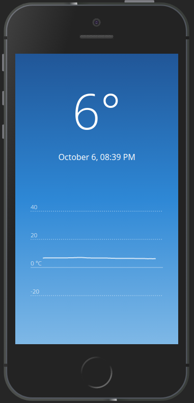

# Remote Temperature Client

A web app showing real-time temperature and a graph with some historical data.

## Environment variables

`REACT_APP_WEBSOCKET_SERVER` - for example `wss://server.example`